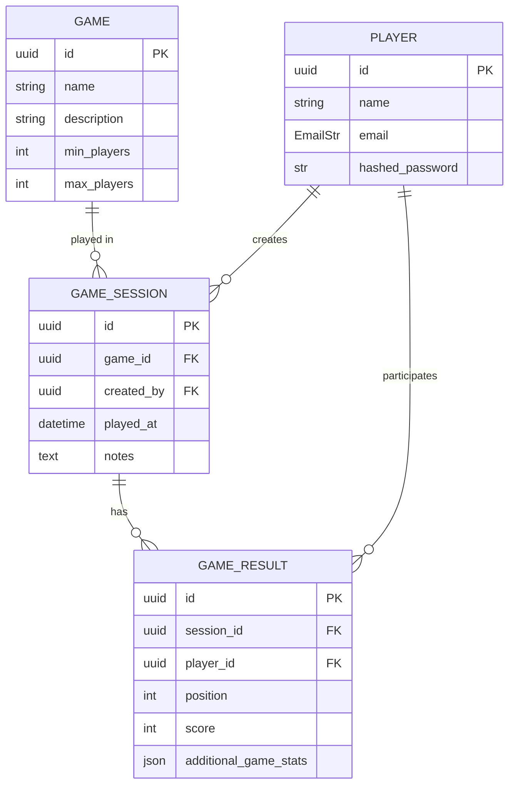

# Boardgame Tracker backend

FastAPI api based backend for Boardgame Tracker

## Run project in dev

For the developpement phase, we are using sqlite as a db and a bash script as setup:

```bash
bash ./scripts/start.sh
```

## Project structure

Greatly inspired by [full-stack-fastapi-template](https://github.com/fastapi/full-stack-fastapi-template/tree/3826039f51d0eafef01b5e814bd35e0c582b0104)

```ini
backend/
├── README.md
├── pyproject.toml
├── uv.lock
├── scripts/
│   └── player.py
├── src/
│   ├── boardgame_tracker_backend/
│   │   ├── main.py # Instanciate the actual app
│   │   ├── api/ # Contains 
│   │   │   ├── all_routes.py # Aggregates all routes for easier import in main app
│   │   │   ├── dependencies.py # What is use in many APIs
│   │   │   └── routers/ # Declare all routes but are passthrough to domain functions
│   │   │       ├── game_sessions.py
│   │   │       ├── games.py
│   │   │       └── players.py
│   │   ├── core/
│   │   │   ├── config.py # All config, env, env vars, ...
│   │   │   ├── database.py # Create the SQLAlchemy engine
│   │   │   └── security.py # 
│   │   ├── domain/ # The actual logic (what does it mean to create a user ?, ...)
│   │   │   └── games.py
│   │   └── models/ # ORM models + corresponding "pydantic" schemas 
│   │       ├── game.py
│   │       ├── game_result.py
│   │       ├── game_session.py
│   │       └── player.py
└── tests/
    └── boardgame_tracker_backend/
        └── test_main.py
```

## Database Schema

