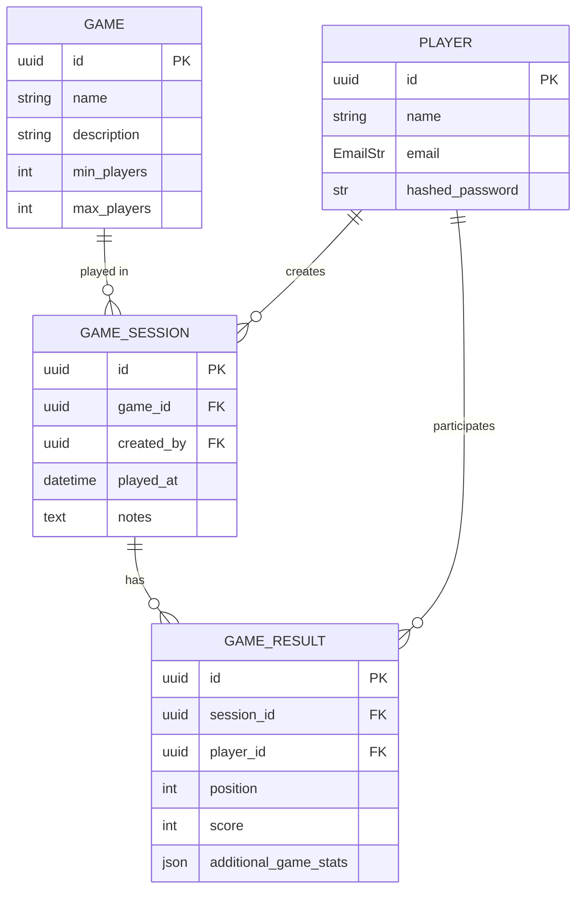

# Boardgame Tracker backend

FastAPI api based backend for Boardgame Tracker

## Run project in dev

For the developpement phase, we are using sqlite as a db and a bash script as setup:

```bash
bash ./scripts/start.sh
```

## Project structure

Greatly inspired by [full-stack-fastapi-template](https://github.com/fastapi/full-stack-fastapi-template/tree/3826039f51d0eafef01b5e814bd35e0c582b0104)

```ini
backend/
├── README.md
├── pyproject.toml
├── uv.lock
├── scripts/
│   └── player.py
├── boardgame_tracker_backend/
│   ├── main.py # Instanciate the actual app
│   ├── api/ # Contains API routing and dependency management
│   │   ├── all_routes.py # Aggregates all routes for easier import in main app
│   │   ├── dependencies.py # What is use in many APIs
│   │   └── routers/ # Declare all routes but are passthrough to domain functions
│   │       ├── game_sessions.py
│   │       ├── games.py
│   │       └── players.py
│   ├── core/
│   │   ├── config.py # All config, env, env vars, ...
│   │   ├── database.py # Create the SQLAlchemy engine
│   │   └── security.py # 
│   ├── domain/ # The actual logic (what does it mean to create a user ?, ...)
│   │   └── games.py
│   └── models/ # ORM models + corresponding "pydantic" schemas 
│       ├── game.py
│       ├── game_result.py
│       ├── game_session.py
│       └── player.py
└── tests/
    └── boardgame_tracker_backend/
        └── test_main.py
```

## Database Schema


```mermaid
erDiagram
    GAME {
        uuid id PK
        string name
        string description
        int min_players
        int max_players
    }
    
    PLAYER {
        uuid id PK
        string name
        EmailStr email
        str hashed_password
    }
    
    GAME_SESSION {
        uuid id PK
        uuid game_id FK
        uuid created_by FK
        datetime played_at
        text notes
    }
    
    GAME_RESULT {
        uuid id PK
        uuid session_id FK
        uuid player_id FK
        int position
        int score
        json additional_game_stats
    }
    
    GAME ||--o{ GAME_SESSION : "played in"
    GAME_SESSION ||--o{ GAME_RESULT : "has"
    PLAYER ||--o{ GAME_RESULT : "participates"
    PLAYER ||--o{ GAME_SESSION : "creates"
```

<details> <summary>Dumb questions </summary>
<li> Bonnes pratiques pour tester une api ? 
    <ul>
        <li>Genre tester la fonction elle même
        <li>Puis tester d'appeler l'api en mockant la sortie de la fonction ?
    </ul>
<li> Bonnes pratiques archi hexa (pas que) dans le cadre d'une API
    <ul>
        <li>Comment remonter les erreurs ? Genre si domain raise, API doit exept + raise la même ?
        <li>Comment faire pour implem la couche db aie aie aie api call func dans domain qui call func dans infrastructure ? 
    </ul>
<li>

</details>


### Getting a tunnel using ngrok
Make a tunnel running ```ngrok http 8000```. Ngrok will print a forwarding URL (for example, `https://<random-subdomain>.ngrok-free.app`); use that URL as the base URL to access the API.